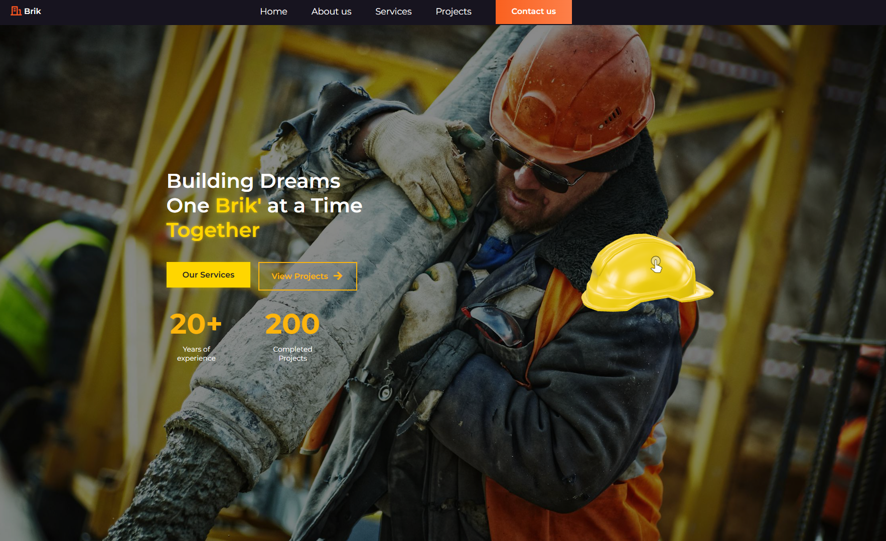
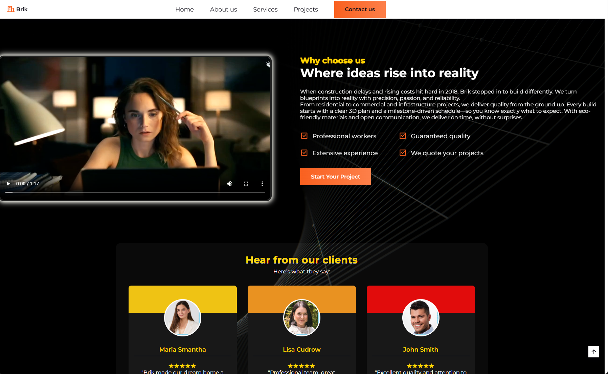
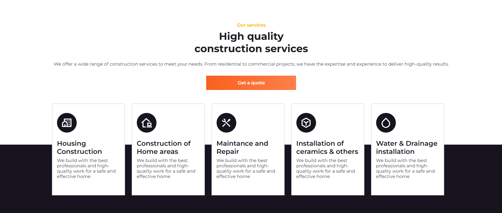
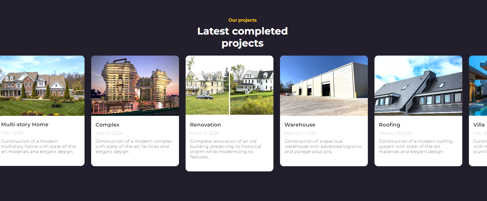
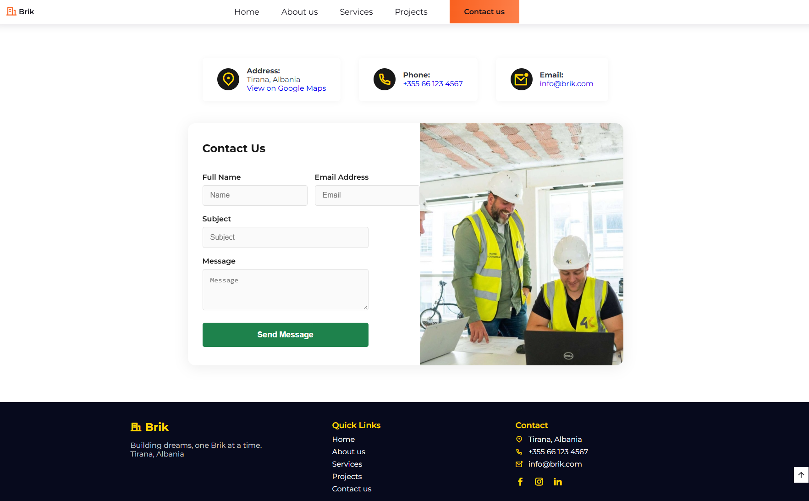
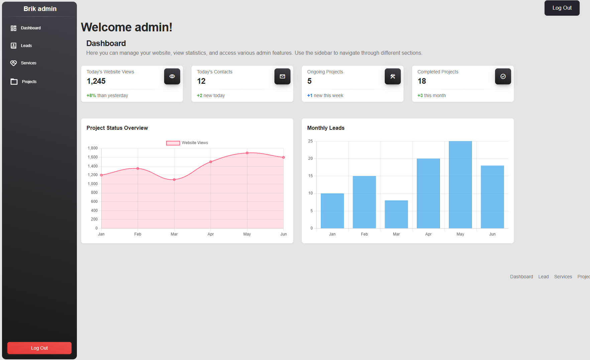
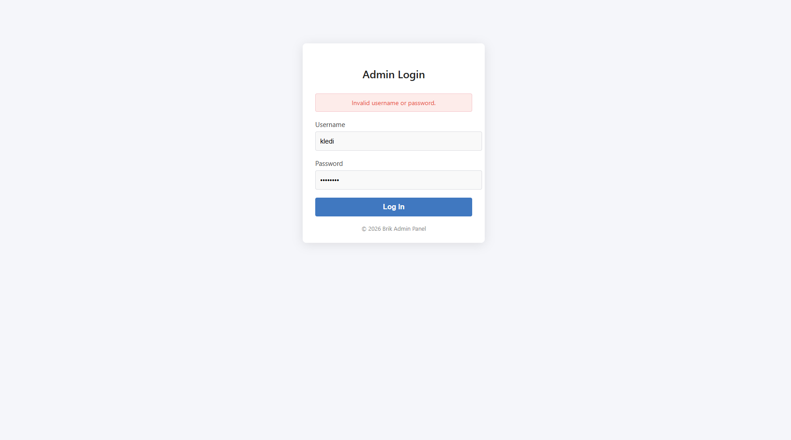
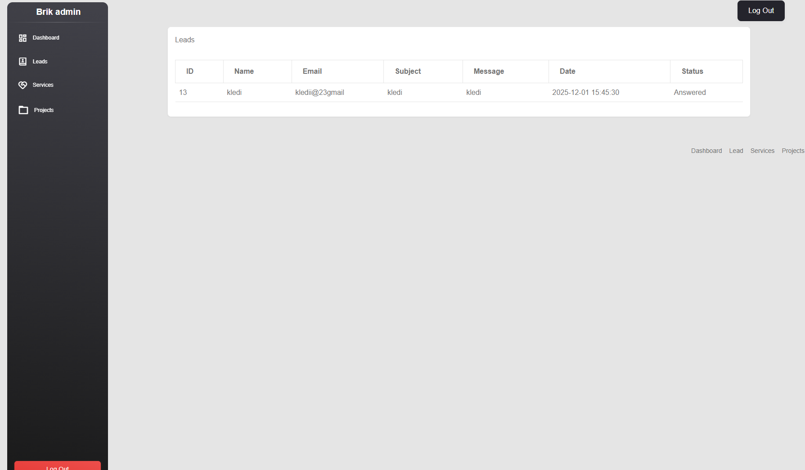
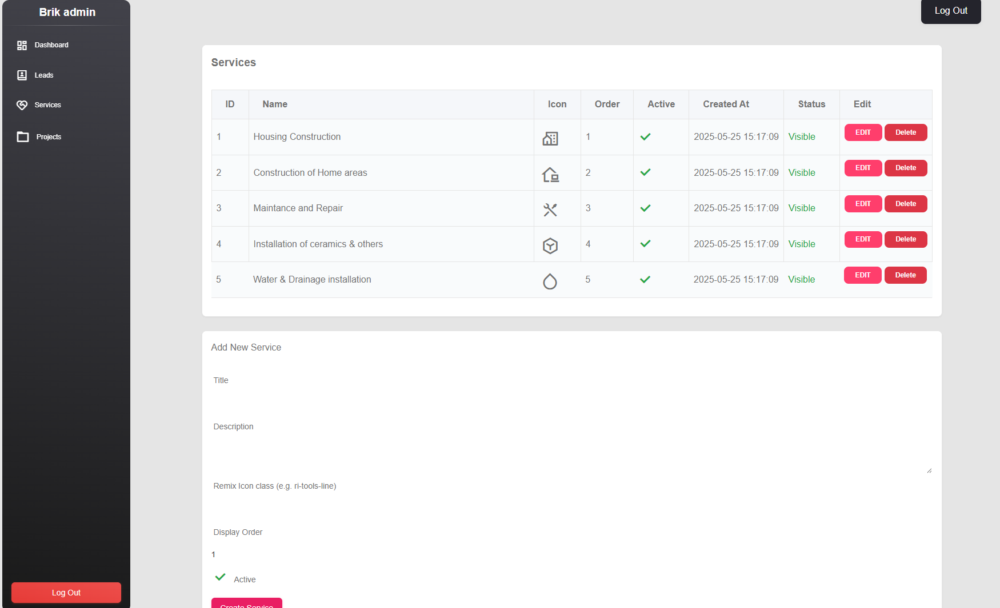
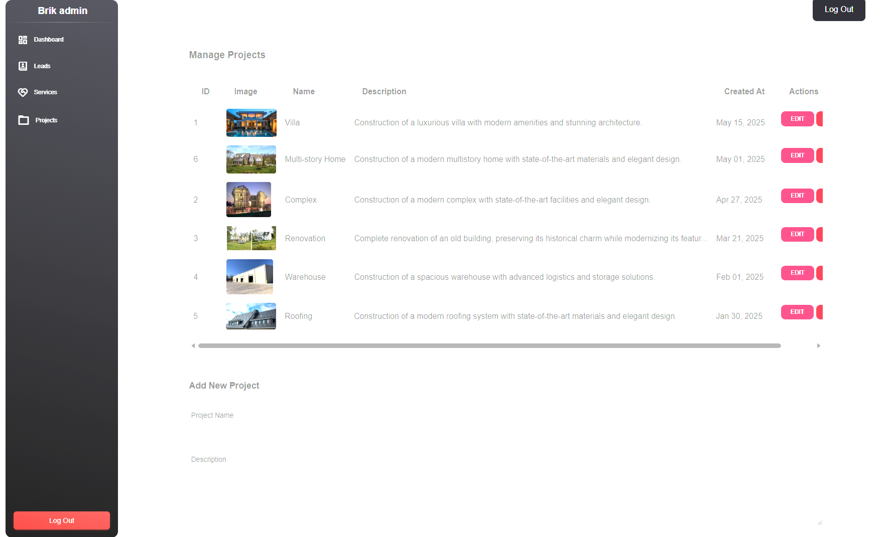

# Brik — Construction Website & Admin Panel

**Building dreams, one Brik at a time.**

A construction company website with a PHP and MySQL back end, an interactive 3D hero, and an admin panel for managing services, projects, and customer enquiries. This project brings together a visual company portfolio and the tools used to maintain its content.

[Features](#features) · [Screenshots](#screenshots) · [Tech stack](#tech-stack) · [Run locally](#run-locally) · [Project structure](#project-structure)



## Features

### Public website

- **Construction portfolio:** a hero section, company introduction, service cards, project gallery, testimonials, and contact details.
- **Interactive 3D model:** a rotating hard hat with camera controls, displayed using Google's `<model-viewer>`.
- **Database-driven content:** active services appear in their configured order, and projects display images, descriptions, and completion dates.
- **Responsive interactions:** mobile navigation, Swiper carousels, scroll animations, and a back-to-top button.
- **Customer enquiries:** a contact form saves each message to the database for review in the admin panel.

### Admin panel

| Area | What it does |
| --- | --- |
| Login | Checks password hashes and starts a PHP session; includes logout. |
| Dashboard | Displays summary cards and Chart.js charts using sample statistics. |
| Leads | Lists customer enquiries, marks them as answered, and opens Gmail compose for a manual reply. |
| Services | Creates, edits, and deletes services; manages icons, display order, and visibility. |
| Projects | Creates, edits, and deletes project entries with descriptions, dates, and image uploads. |

Services and project changes are reflected on the public website. The enquiry workflow connects the public contact form to the admin Leads screen; it does not send email automatically.

## Screenshots

All ten screenshots show the running local project with existing content: the homepage preview above, followed by the website sections and admin screens below.

### Website tour

#### About the company and client testimonials

A company introduction with an embedded video, project call to action, and testimonial cards.



#### Construction services

Service cards combine icons, titles, and descriptions with a quote request call to action.



#### Completed projects

An image-led project carousel presents residential, commercial, renovation, and roofing work.



#### Contact form and footer

Visitors can find the company's contact details and submit an enquiry with their name, email, subject, and message.



### Admin panel tour

#### Dashboard

Summary cards and charts provide a dashboard presentation. The displayed totals and chart values are demo data, rather than live analytics.



#### Admin login and validation feedback

The login screen includes username and password fields. This screenshot shows the feedback displayed after an unsuccessful login attempt.



#### Customer leads

The Leads screen lists submitted messages and their response status.



#### Service management

Administrators can maintain service content, choose icons, set ordering, and control which entries are visible.



#### Project management

The project management screen displays project images and details alongside editing controls and a form for adding new work.



## Tech stack

| Layer | Technologies |
| --- | --- |
| Front end | HTML, CSS, vanilla JavaScript |
| Back end | PHP, PDO, MySQL / MariaDB |
| Website interactions | Swiper, ScrollReveal, Google `<model-viewer>` |
| Admin interface | Material Dashboard styles, Bootstrap, Chart.js |
| Icons and fonts | Remix Icon, Google Material icons, Google Fonts |
| Local environment | XAMPP with Apache and MySQL |
| Large media | Git LFS for the About section video |

## Run locally

### 1. Prepare the environment

Install Git with Git LFS and XAMPP, or an equivalent PHP server with MySQL/MariaDB and the PDO MySQL extension. Start **Apache** and **MySQL** in the XAMPP control panel.

Internet access is needed for the fonts, icons, 3D viewer, and charts loaded from external providers. No npm or Composer installation is required for this project.

### 2. Clone the project

For a fresh installation on Windows, run these commands from PowerShell:

```powershell
cd C:\xampp\htdocs
git lfs install
git clone https://github.com/Kledi-Rremi/Constructionwebsite.git website
cd website
git lfs pull
```

If you already have the project in `C:\xampp\htdocs\website`, skip cloning it again. The LFS download supplies `assets/img/aboutus.mp4`.

### 3. Create the database

Open [phpMyAdmin](http://localhost/phpmyadmin/), create a database named `website`, select it, and import [database/schema.example.sql](database/schema.example.sql).

The schema creates four tables:

| Table | Stores |
| --- | --- |
| `admins` | Admin usernames and password hashes |
| `services` | Service content, icons, order, and visibility |
| `projects` | Project details, dates, and image paths |
| `contacts` | Customer enquiries and handling status |

The public schema creates empty tables. It does not include an admin account or the existing records shown in the screenshots.

### 4. Configure the database connection

Update [db.php](db.php) if your database name or local MySQL credentials differ. Its current XAMPP settings are:

```php
$host = 'localhost';
$db   = 'website';
$user = 'root';
$pass = '';
```

### 5. Create your admin account

Generate a bcrypt hash with PHP, replacing `REPLACE_WITH_YOUR_PASSWORD` with your chosen password:

```powershell
C:\xampp\php\php.exe -r "echo password_hash('REPLACE_WITH_YOUR_PASSWORD', PASSWORD_BCRYPT), PHP_EOL;"
```

In phpMyAdmin, select the `website` database and run this SQL. Replace the example username and paste the generated hash in place of `PASTE_YOUR_BCRYPT_HASH_HERE`:

```sql
INSERT INTO admins (username, password)
VALUES ('your_admin_username', 'PASTE_YOUR_BCRYPT_HASH_HERE');
```

### 6. Open the website

- **Website:** [http://localhost/website/](http://localhost/website/)
- **Admin login:** [http://localhost/website/admin/login.php](http://localhost/website/admin/login.php)

Log in with the account you created, then add services and projects through the admin panel to populate the homepage. Keep `assets/img/projects/` writable by the PHP server for project image uploads. Submit an enquiry through the public contact form to see it appear in Leads.

## Project structure

```text
Constructionwebsite/
├── README.md                   # Project overview and screenshot tour
├── index.php                   # Public website
├── db.php                      # PDO database connection
├── contact_submit.php          # Saves customer enquiries
├── admin/
│   ├── login.php               # Admin login
│   ├── logout.php              # Ends the admin session
│   ├── index.php               # Dashboard with sample charts
│   ├── contact.php             # Leads and response status
│   ├── services.php            # Service management
│   ├── projects.php            # Project management and image uploads
│   └── includes/               # Shared layout and admin assets
├── assets/
│   ├── style.css               # Public website styles
│   ├── main.js                 # Navigation, carousels, and animations
│   └── img/                    # Photos, project images, 3D model, and video
├── database/
│   └── schema.example.sql      # Database structure without account credentials
└── docs/
    └── screenshots/            # Images embedded in this README
```

## Running online

To run the application online, use a server that supports PHP and MySQL/MariaDB. The GitHub repository showcases the source code and screenshots; opening the repository does not run the PHP application.

## Author

Created by [Kledi Rremi](https://github.com/Kledi-Rremi).
